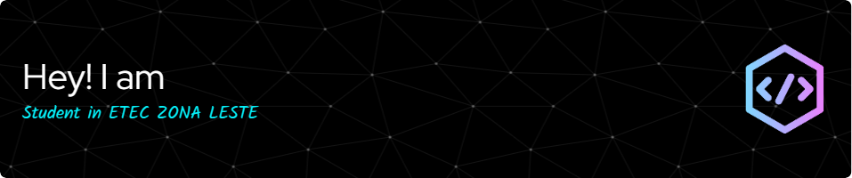

  

###

<h1 align="center">Hey there 👋</h1>

###

<h3 align="left">👩‍💻  About Me</h3>

###

I'm ...  • An Etec student from the East Zone in 3rd Year • A technology enthusiast  • A supporter of the Open-source community • And simply curious

###

<h3 align="left">🛠 Language and tools</h3>

###

  
  
  
  
  
  
  
  
  
  
  
  
  
  
  
  
  
  
  
  
  
  
  
  
  

###

<h3 align="left">🔥   My Stats :</h3>

###

  

###